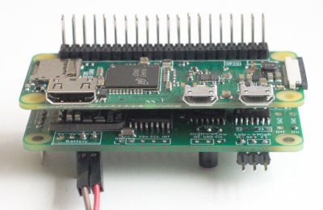

Frame for the Inky-Impression
=============================

In this directory you will find three STL-files for a frame. The frame
is open at the back and should be attached to a wall.

Assembly
--------

The first step after printing is to glue the connector to the body:

Then, put the Inky on top and use the plate and the screws to secure
the display:

That's it! Add the Pi (and a battery) at the back and put it to a wall.

Note that the frame has a small hole for the battery-charger, but you
could also use it for an USB-cable to directly power the Pi.

Pi and Battery
--------------

If you take a close look at the first image, you will see a
18650-battery holder at the bottom of the frame-body. The holder and
a TP4056 (charger) with an integrated DW01 (overcharge and
deep-discharge protection) are on a small pcb. You might have to adapt
the frame-design for your own battery-solution.

Since the Inky only exposes a single GPIO in addition to I2C and SPI,
I decided to equip my Pi-Zero with extra long pins, so that I have
pins on both sides. This enables me to put a hat _below_ the Zero:

Bottom side:

This self-designed hat takes care of the battery-management, i.e. it
controls the enable-pin of a DC-DC-converter to keep power consumption
low. For details see [here](https://github.com/bablokb/pcb-pi-batman).

