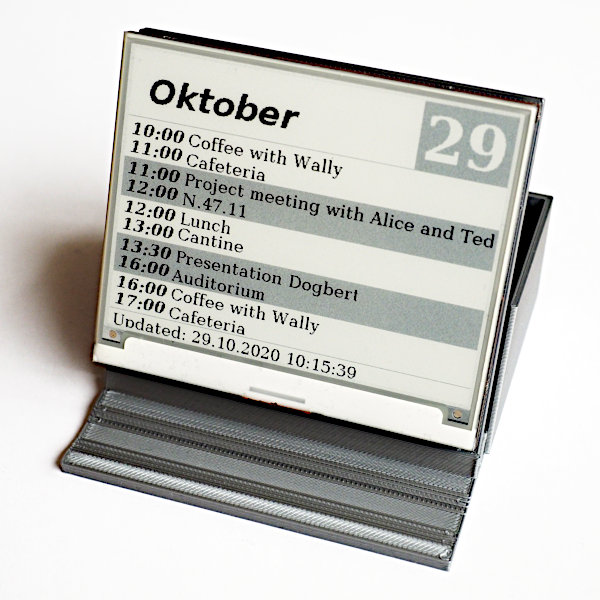
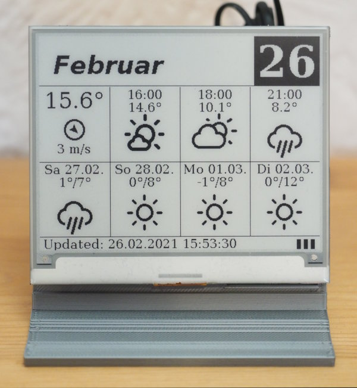

Display Daily Agenda on an E-Ink Display
========================================

Overview
--------

This is a project using a Raspberry Pi and an Inky-wHat (3 colors) or
Inky-Impression (7 colors) from Pimoroni for a display of the daily
agenda of one or more calendars (the calendars must be accessible via
CALDAV, but this is usually the case). Instead of the daily agenda
the program can display alternate contents, currently it supports
the weather-forecast using OpenWeatherMap data.

The system-setup (installation) is described below. To setup the
hardware and software, skip to the pages

  - [hardware-setup](hardware-setup.md)
  - [software configuration](configuration.md)

Since an e-ink display keeps its content even after power is turned off,
the Pi boots, updates the display and shuts down again. This repository
has all the necessary software for this process, including the definition
of a systemd-service. If you are running from a wall-plug, a regular
update of the display is also possible, see below for details.

A normal update-cycle with some boot-time optimizations takes about one
minute. System-boot is more than half of this time, another 15 seconds are lost
during initialization of the python3-interpreter, the update of the
black&white variant of the wHat takes 8 seconds (the Inky-Impression takes
three times longer).

Installation
------------

To install all necessary software, including the prereqs for the inky, run

    git clone https://github.com/bablokb/pi-e-ink-daily.git
    cd pi-e-ink-daily
    sudo tools/install

You can run this multiple times to update this software. Prereqs,
e.g. the inky-library, have to be updated manually:

    sudo pip3 install --upgrade inky

*Note that you might also have to update your existing configuration file*.
The default configuration-file `/etc/pi-e-ink-daily.defaults.json` is
always overwritten and should not be edited.

The install-command will

  - install all necessary packages via apt and pip
  - install the python-script which updates the display from this repo
  - configure a systemd-service which updates the display on boot
    and directly shuts down afterwards
  - configures spi, i2c and the gpio-poweroff overlay in `/boot/config.txt`
    for GPIO4.
    Note that this GPIO is available on the back of the wHat and must
    be connected to the battery-management pcb.

Timer-Mode
----------

The default install-script will install a systemd-service for the battery-optimized
boot-update-shutdown cycle. If you run your e-ink from a wall-plug, a different
scheme is available. Here the systemd-service is triggered every ten minutes by
a systemd-timer, and no shutdown occurs. To change the interval, edit
`/etc/systemd/system/pi-e-ink-daily.timer` using
`sudo systemctl edit pi-e-ink-daily.timer`. This will create an override-file and
changes won't be overwritten by subsequent updates.

To install this timer-mode, run

    sudo tools/install-timer

after the normal install command. A typical update scenario would then look like this:

    cd pi-e-ink-daily
    git pull
    sudo systemctl stop pi-e-ink-daily.timer
    sudo tools/install
    sudo tools/install-timer

In timer-mode and if you don't use your Pi for other purposes, it makes sense to
switch your Pi into *read-only mode*. This can be done using `raspi-config` option
`4 Performance Options -> P3 Overlay File System`. Once in read-only mode, you can
just pull the plug any time, there is no need for a clean shutdown anymore.

If you need to update the system, you have to switch back to normal mode using
the same entries within `raspi-config` again.

Administration-Mode
-------------------

There is a special boot-mode called *admin-mode*: in this mode the Pi
boots normally but does not update the display and does not shutdown,
even if auto-shutdown is active.

Admin-mode is necessary to update the software of the Pi. To enter
this mode, pull GPIO24 low during boot. On an Inky-Impression, this
GPIO is tied to key "D" (last key), so just press this key until the
system is up.

Inky-Impression Keys
--------------------

In my setup, I am using the pHat from <https://github.com/bablokb/pcb-pi-batman>
as the battery-interface (image [here](Inky-Impression-Frame/pi-with-hat.jpg)).
This allows using some of the Impression keys:

|GPIO   | Key  | pHat        | usage
|-------|------|-------------|-------------------
|GPIO5  |  A   | -           | power-on (if wired to SW1-Pin2(*))
|GPIO6  |  B   | SW2 (off)   | shutdown (via dtoverlay=gpio-shutdown,gpio_pin=6)
|GPIO16 |  C   | low-battery | don't use (conflict with low-battery indicator)
|GPIO24 |  D   | -           | boot in admin-mode
|GPIO23 |  -   | -           | drive high: attach external LED

(*) bottom left

Weather-Icons
-------------

The weather icons are licensed under SIL OFL 1.1, courtesy of
Eric Flowers [https://github.com/erikflowers/weather-icons](https://github.com/erikflowers/weather-icons).
