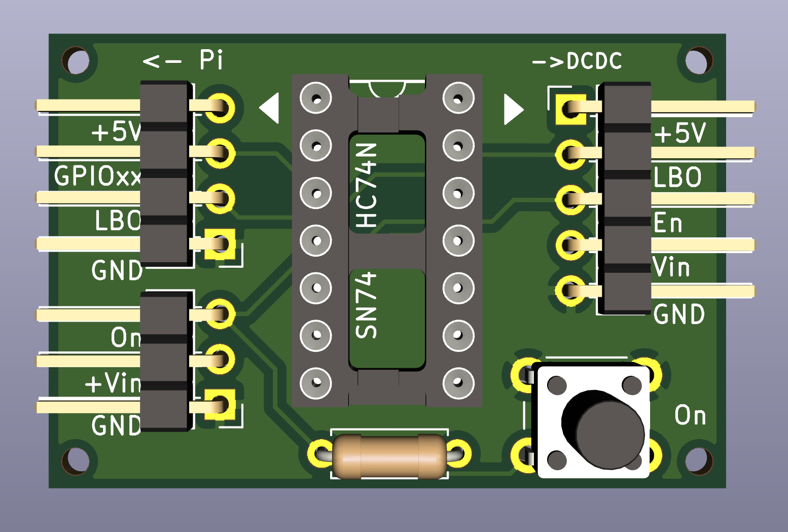

Display Daily Agenda on an E-Ink Display
========================================

Overview
--------

This is a project using a Raspberry Pi and an Inky-wHat (3 colors) or
Inky-Impression (7 colors) from Pimoroni for a display of the daily
agenda of one or more calendars. Porting to other hardware should be
straightforward.

The calendars must be accessible via CALDAV, but this is usually the case.

Since an e-ink display keeps its content even after power is turned off,
the Pi boots, updates the display and shuts down again. This repository
has all the necessary software for this process, including the definition
of a systemd-service.

E-inks are ideal for battery-based projects, otherwise there is no
justification for the extra cost and missing functionality of these displays.
You can find a simple circuit/pcb for the necessary battery-management
[here](https://github.com/bablokb/pcb-pi-batman):

The circuit uses a flip-flop to manage the current-supply from the battery
to the Pi. A prerequisite is a DC-DC converter with an enable pin. The
button (or an external device) turns on the Pi by pulling the enable pin high.
The Pi itself turns of the current after shutdown by pulling the enable
pin low again.

Adafruit has other nice solutions for this, e.g. an enable timer button
(works the same way, but powers on every two hours or shorter), or a
pushbutton power-switch.

Hardware
--------

The minimal list of required hardware is short:

  - a Raspberry Pi Zero-W
  - an Inky-wHAT or Inky-Impression from Pimoroni

Since the e-ink displays only expose GPIO4 (besides I2C and SPI), I
soldered long pins to the Pi Zero-W to have pins on both sides, so
every pin not used by the display is available from the back.

Optional components:

  - a LiPo battery
  - a DC-DC converter (e.g. a PowerBoost 500C from Adafruit)
  - battery-management pcb (see above)
  - 3D-printed [stand](https://www.tinkercad.com/things/f5TTT5WoGkW)

A normal update-cycle with some boot-time optimizations takes about one
minute. System-boot is more than half of this time, another 15 seconds are lost
during initialization of the python3-interpreter, the update of the
black&white variant of the wHat takes 8 seconds (the Inky-Impression takes
three times longer).

Average power-requirement is 115mA (measured for the wHat), so the
update-cycle draws 2mAh from the battery. A normal 1200mAh LiPo should
therefore last at least a year with a daily update.

Installation
------------

To install all necessary software, including the prereqs for the inky, run

    git clone https://github.com/bablokb/pi-e-ink-daily.git
    cd pi-e-ink-daily
    sudo tools/install

You can run this multiple times to update this software. Prereqs,
e.g. the inky-library, have to be updated manually:

    sudo pip3 install --upgrade inky

Note that you might also have to update your existing configuration file.
The default configuration-file `/etc/pi-e-ink-daily.defaults.json` is
always overwritten and should not be edited.

The install-command will

  - install all necessary packages via apt and pip
  - install the python-script which updates the display from this repo
  - configure a systemd-service which updates the display on boot
    and directly shuts down afterwards
  - configures spi, i2c and the gpio-poweroff overlay in `/boot/config.txt`
    for GPIO4.
    Note that this GPIO is available on the back of the wHat and must
    be connected to the battery-management pcb.

Configuration
-------------

Besides a reboot, you also need to configure the program, e.g. the url of
your calendar. Configuration is via the file `/etc/pi-e-ink-daily.json`.
Just edit it with a simple editor, the variable-names should be
self-explanatory. Depending on your system, you might need to edit the
paths to the fonts, otherwise, you typically only need to edit the
CALDAV-settings:

    "dav_url"      : "https://example.com/caldav.php",
    "dav_user"     : "somebody",
    "dav_pw"       : "somebodies_password",
    "cal_name"     : "mycal",
    "cal_color"    : "white"

Note you can query multiple calendars. Using a different color
than white or gray for the background of the agenda-entry (`cal_color`)
is not recommended for a wHat.

A note on the TITLE-setting:

    "TITLE" : "",

If this variable is the empty string, the title will show the current month.
If it starts with a `%`, it will be interpreted as a strftime-spec.

There are two settings which are only necessary for desktop-simulation:

  "WIDTH"        : 400,
  "HEIGHT"       : 300,

If the program detects a real inky, it will use the physical dimensions.

During tests you might want to disable the service or remove at least
the instant shutdown from the systemd-service file
`/etc/systemd/system/pi-e-ink-daily.service`:

    [Unit]
    Description=Update Daily-Agenda on E-Ink Display
    Requires=network-online.target
    After=network-online.target
    Wants=network-online.target

    [Service]
    Type=oneshot
    RemainAfterExit=true
    ExecStart=/usr/local/bin/daily_agenda.py
    ExecStart=/bin/systemctl poweroff

    [Install]
    WantedBy=multi-user.target

Just add a hash (comment) before the second `ExecStart`.
